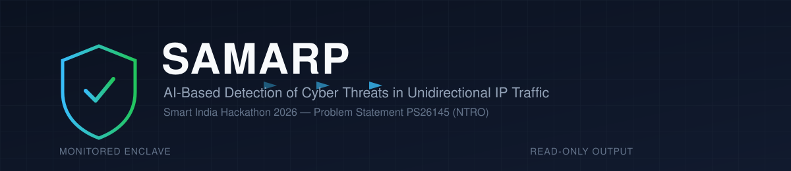
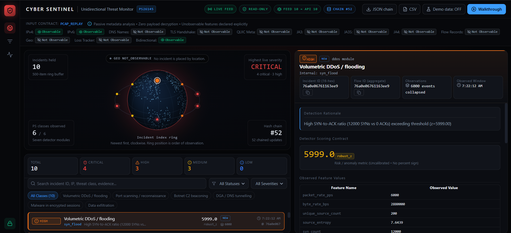
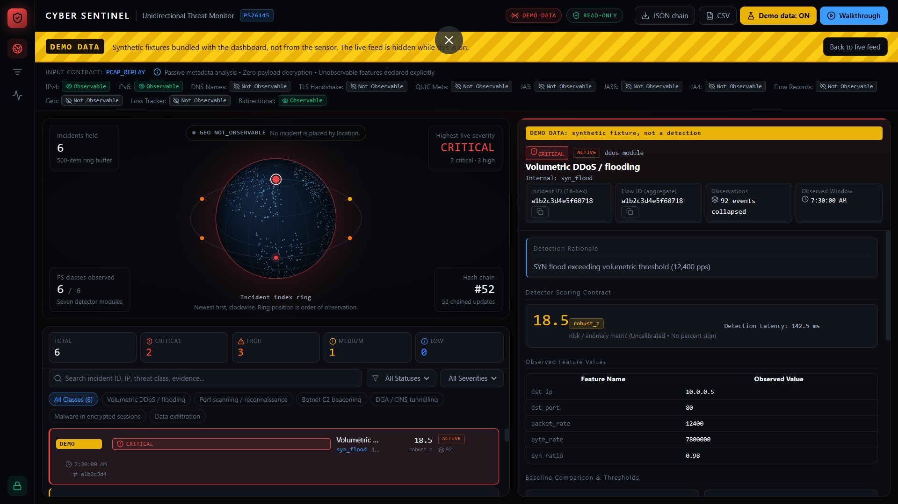

<div align="center">



# SAMARP

### AI-Based Detection of Cyber Threats in Unidirectional IP Traffic

*Smart India Hackathon 2026 · Problem Statement PS26145 · NTRO*

[](LICENSE)
[](https://www.python.org/)
[](api)
[](dashboard)
[](ps26145_traceability_matrix.md)

</div>

---

SAMARP is a passive, streaming threat-detection pipeline for a monitored network that sits behind a one-way boundary. It reads copied packet headers (PCAP) and exported flow records (NetFlow v9 / IPFIX), extracts metadata features, runs eight detector modules covering the six PS26145 threat classes, and stores the results as deduplicated, evidence-rich incidents in a tamper-evident hash-chained ledger. It never sends traffic back into the monitored network, never decrypts TLS/QUIC payload, and needs no internet connection at run time.

> [!IMPORTANT]
> All detection metrics in this repository come from **synthetic** traffic (a synthetic benign replay plus a labelled synthetic attack suite). The only real data used is the Tranco benign-domain list for the DGA model. No real network capture has been evaluated yet — see [Validation & Evaluation](#validation--evaluation) and [Limitations](#limitations).

---

## Table of Contents

- [Problem Statement](#problem-statement)
- [Design Principles](#design-principles)
- [Architecture](#architecture)
- [Threat Detection](#threat-detection)
- [Detection Methodology](#detection-methodology)
- [Feature Engineering](#feature-engineering)
- [Alert Format](#alert-format)
- [Performance](#performance)
- [Validation & Evaluation](#validation--evaluation)
- [DGA Evaluation: Rules vs LightGBM](#dga-evaluation-rules-vs-lightgbm)
- [Repository Structure](#repository-structure)
- [Installation](#installation)
- [Configuration](#configuration)
- [Running SAMARP](#running-samarp)
- [PCAP Evaluation](#pcap-evaluation)
- [Testing](#testing)
- [API](#api)
- [Dashboard](#dashboard)
- [Security Design](#security-design)
- [Limitations](#limitations)
- [Roadmap](#roadmap)
- [SIH 2026 Context](#sih-2026-context)
- [Documentation Map](#documentation-map)
- [License](#license)

---

## Problem Statement

High-security networks are often connected to the outside world through a **unidirectional link** (a data diode or passive tap): traffic can be copied *out* for monitoring, but nothing can travel back *in*. A monitoring system on the far side cannot probe hosts, complete handshakes, query external services or block anything. It sees only what is copied to it, and most of that traffic is encrypted.

PS26145 asks for AI-assisted detection of six threat classes under those conditions. SAMARP focuses on **metadata-driven detection of these threat classes without requiring payload decryption**:

| # | PS threat class | What the metadata looks like |
|---|---|---|
| a | Volumetric / protocol DDoS | Packet-rate spikes, SYN floods without ACKs, UDP reflection from many amplifiers, low-rate Slowloris connection exhaustion |
| b | Botnet C2 beaconing | Regular, low-jitter connections from one host to the same destination |
| c | DGA domains / DNS tunnelling | Random-looking query names, NXDOMAIN bursts, long high-entropy labels, unusual TXT/NULL/CNAME share |
| d | Malware in encrypted sessions | TLS/QUIC fingerprints (JA3/JA3S/JA4), missing SNI, fixed small-packet shapes, never-seen fingerprints |
| e | Reconnaissance / port scanning | One source touching many ports or many hosts |
| f | Data exfiltration | Large, strongly outbound byte volumes |

SAMARP does not claim complete detection of every attack in these classes. Known misses are listed per class in [Validation & Evaluation](#validation--evaluation).

---

## Design Principles

Each principle below is backed by code or a test in this repository.

| Principle | How it is realised |
|---|---|
| **Passive monitoring** | Ingest modules read files and bytes only; no socket, probe or outbound call (`ingest/flow_record_adapter.py`, `ingest/pcap.py`) |
| **No return path from the software** | The API exposes `GET` routes and one WebSocket; `POST`/`PUT`/`DELETE` return `405` (`tests/api/test_api_and_persistence.py::test_plane_b_strictly_read_only`) |
| **Metadata first, no decryption** | The normalized-event schema has no payload field (`test_schema_has_no_payload_or_content_field`); TLS alerts state that no decrypted bytes were inspected |
| **Missing evidence is never benign** | Unobservable inputs are reported as `DEGRADED` / `NOT_OBSERVABLE` (`ingest/capability.py`, `test_missing_evidence_is_not_benign`) |
| **Streaming detection** | 1 s tumbling windows behind a 300 ms watermark; per-alert `latency_ms` measured with `perf_counter_ns` |
| **Bounded memory** | Flow tracker, template cache and detector state are capped with eviction |
| **Multiple detection techniques** | Robust statistics, rules, offline intelligence and one shadow-mode LightGBM model |
| **Tamper-evident records** | Every incident is appended to a SHA-256 hash chain (`alerts/hash_chain.py`) |
| **Offline at run time** | No live feed, geolocation service or LLM; intelligence ships as a versioned bundle in `intel/` |

---

## Architecture

```mermaid
flowchart LR
    A["Passive input<br/>classic PCAP (header-only replay)<br/>NetFlow v9 / IPFIX records"] --> B
    B["ONE-WAY / READ-ONLY BOUNDARY<br/>(physical diode or TAP = deployment;<br/>no write path = software)"] --> C
    C["ingest/<br/>normalization · replay clock<br/>bounded flow tracking · capability state"] --> D
    D["features/<br/>entropy · robust stats · inter-arrival<br/>DNS lexical + qtype · TLS/QUIC shape"] --> E
    E["detectors/<br/>8 modules → 6 PS classes<br/>(+ LightGBM DGA in shadow)"] --> F
    F["alerts/<br/>dedup (frozen keys) · confidence<br/>SHA-256 hash chain"] --> G
    G[("SQLite<br/>incident ledger")] --> H
    H["api/<br/>FastAPI GET routes<br/>+ /ws/incidents"] --> I
    I["dashboard/<br/>React + TypeScript + Vite"]
```



| Component | Directory | Role |
|---|---|---|
| Ingestion | `ingest/` | Reads classic PCAP (`pcap.py`, headers only) and NetFlow v9 / IPFIX v10 through one shared template-based decoder (`flow_record_adapter.py`). Normalizes everything to one event contract, tracks flows in a bounded table, derives deterministic `flow_id`s and declares per-field capability. |
| Features | `features/` | Stateless primitives (`stateless.py`, `entropy.py`), tumbling-window aggregation (`rolling.py`), lexical DNS features (`extractor.py`) and the frozen `FEATURE_ORDER` (`feature_order.py`). |
| Detectors | `detectors/` | `pipeline.py` coordinates `ddos`, `reflection`, `scan`, `c2`, `dga`, `dns`, `tls_quic` and `exfil`. |
| Alerts | `alerts/` | Deduplicates alerts into incidents (`deduplicator.py`), assigns severity (`scorer.py`), maps raw scores to `confidence` (`confidence.py`) and appends to the hash chain (`hash_chain.py`). |
| Storage + API | `api/` | SQLite persistence, read-only FastAPI routes and a batched WebSocket stream. |
| Dashboard | `dashboard/` | Operator UI: live incident feed, filters, evidence drawer, capability banner. |
| Scenarios | `scenarios/` | Deterministic canonical campaign, synthetic benign background and labelled synthetic attack suite used for demo and evaluation. |

JSON appears only at the storage boundary and the WebSocket/API output. Processing between normalization and persistence is in-process.

> **Input modes.** The frozen `input_mode` enum is `pcap_replay | live_tap | ipfix | netflow_v9 | sflow`. Implemented readers exist for classic PCAP replay and NetFlow v9 / IPFIX. `live_tap` and `sflow` are declared with capability baselines, but the repository contains no live-capture or sFlow decoder. There is no Suricata EVE reader yet, so on a real PCAP the DNS- and TLS-based detectors report `NOT_OBSERVABLE`.

---

## Threat Detection

| PS class | Module | Detection approach | Key signals | Status |
|---|---|---|---|---|
| a · DDoS | `detectors/ddos.py` | Robust z-score against a rolling baseline, SYN/ACK imbalance, hysteresis | pps, byte rate, SYN vs ACK counts, source entropy | Implemented, tested |
| a · Slowloris | `detectors/ddos.py` (separate path) | Low-rate connection-exhaustion rule | Concurrent connections, duration, bytes per connection | Implemented, tested |
| a · UDP reflection / amplification | `detectors/reflection.py` | Streaming sliding-window fan-in rule | Distinct amplifiers per victim, reflected pps / bps, share of unsolicited responses, amplifier ports | Implemented, wired into pipeline, tested |
| b · C2 beaconing | `detectors/c2.py` | Inter-arrival periodicity | Coefficient of variation of inter-arrival times (`cv_max` 0.15), minimum 8 events, NTP/DNS exemptions, fleet-prevalence rule | Implemented, tested |
| c · DGA | `detectors/dga.py` | Rule score decides; LightGBM runs in **shadow** | Length, entropy, digit/vowel ratio, character bigram/trigram LM scores, NXDOMAIN rate | Implemented, tested |
| c · DNS tunnelling | `detectors/dns.py` | Rules | Query-name length and entropy, TXT/NULL/CNAME share, queries/s per registered domain | Implemented, tested |
| d · Encrypted-session malware | `detectors/tls_quic.py` | Offline intel + novelty + shape rules | Known-bad JA3 list, missing SNI to a direct IP, fixed small-packet shape, JA3/JA4 novelty over `novelty_days` | Implemented, tested |
| e · Recon / scanning | `detectors/scan.py` | Distinct-count thresholds per window | Unique ports (vertical), unique hosts (horizontal); service-port replies not counted as probes | Implemented, tested |
| f · Exfiltration | `detectors/exfil.py` | Direction-correct volume and ratio | Outbound bytes, outbound/inbound ratio, robust z | Implemented, tested |

Eight internal detector modules serve six external PS classes. Slowloris is a path inside `ddos`, not a ninth module.

---

## Detection Methodology

SAMARP is a **hybrid** system. Rule-based and statistical detectors make every production alert decision today. One machine-learning model runs alongside them in shadow mode.

### Statistical and rule-based detection

- **Robust statistics.** DDoS and exfiltration compare the current window to a baseline with median / MAD robust z-scores, so a single outlier does not shift the baseline.
- **Periodicity.** C2 flags host–destination pairs whose inter-arrival coefficient of variation stays under `cv_max`.
- **Distinct counts.** Scanning and reflection count distinct ports, hosts or amplifiers inside a window.
- **Lexical scoring.** The DGA rule combines entropy, character-ratio and n-gram language-model scores with an NXDOMAIN burst condition.
- **Offline intelligence.** TLS detection uses a local known-bad JA3 list and a learned site fingerprint baseline (`config/tls_fingerprint_baseline.json`, `scripts/learn_tls_baseline.py`).

All tunable thresholds live in `config/thresholds.yaml`.

### Machine learning

| | |
|---|---|
| Model | LightGBM classifier (`dga-lightgbm-0.3.0`) + Platt calibration — the **only** trained model |
| Task | Is a single DNS query name DGA-generated? (PS class c) |
| Features | 7 lexical features from the query name only: `length`, `entropy`, `digit_ratio`, `vowel_ratio`, `label_count`, `lm_bigram`, `lm_trigram` |
| Training data | Synthetic benign names + 6,000 real Tranco domains; synthetic DGA names from 5 locally written generic styles (not DGArchive) |
| Evaluation | Grouped split, held-out vocabulary, disjoint real Tranco test half, leave-one-family-out |
| Pipeline role | **Shadow** (`dga.model_mode: shadow`): it scores every DNS query and its probability is recorded in `evidence.model`, but the rule detector decides |
| Artifact | `models/artifact/` (gitignored; SHA-256 in `benchmarks/dga_eval_20260924T191002Z.json`). Text booster + JSON, no pickle. Without the artifact or `lightgbm`, the pipeline runs rules only |

Why shadow: on real held-out domains the model's false-positive rate (0.98 %) is higher than the rules' (0.05–0.25 %). See [DGA Evaluation](#dga-evaluation-rules-vs-lightgbm) and `docs/model_card.md`.

---

## Feature Engineering

Features verified in `features/` and the detectors:

| Category | Features |
|---|---|
| Volume / rate | Packets per second, byte rate, per-window event counts |
| TCP flags | SYN and ACK counts per destination |
| Directionality | Outbound/inbound bytes and ratio (from `config/address_plan.yaml`), upstream/downstream packet ratio |
| Ports / fan-out | Distinct destination ports, distinct destination hosts, distinct reflecting sources |
| Timing | Inter-arrival median, p95 and coefficient of variation; connection duration and concurrency (Slowloris) |
| Distribution | Shannon entropy of sources and strings |
| DNS lexical | Length, entropy, digit ratio, vowel ratio, label count, character bigram and trigram LM scores |
| DNS behaviour | NXDOMAIN rate, qtype TXT/NULL/CNAME ratios, qtype entropy, queries/s per registered domain |
| TLS/QUIC | JA3, JA3S, JA4 (when the input supplies them), SNI presence, first-N packet sizes, packet-size mean and p95 |

The frozen order used by both training and inference is `features/feature_order.py` (23 features). `tests/parity/test_feature_parity.py` guards it.

---

## Alert Format

The contract is `schemas/alert.schema.json` (schema version **1.3**). Required fields:

`schema_version`, `timestamp`, `flow_id`, `flow_ref_type`, `ps_class`, `threat_class`, `detector`, `confidence`, `score_type`, `calibrated`, `calibrated_on`, `evidence`, `incident_id`, `capability`

Excerpt of a real DGA alert from the canonical replay (`benchmarks/sample_alert_20260924T191325Z.json`, some fields trimmed):

```json
{
  "schema_version": "1.3",
  "timestamp": "2026-03-12T01:48:16.000000+00:00",
  "flow_id": "8270d1e1d802714e",
  "flow_ref_type": "entity",
  "ps_class": "DGA / DNS tunnelling",
  "threat_class": "dga_domain",
  "detector": "dga",
  "score": 0.882,
  "score_type": "rule_score",
  "confidence": 0.882,
  "calibrated": false,
  "calibrated_on": "uncalibrated",
  "severity": "MEDIUM",
  "status": "NEW",
  "evidence": {
    "interpretation": "DGA burst detected from 10.0.0.45: 5 queries, avg rule score 0.88, NXDOMAIN rate 100.0%",
    "nxdomain_rate": 1.0,
    "query_count": 5,
    "model": {
      "mode": "shadow (rules decide)",
      "model_version": "dga-lightgbm-0.3.0",
      "mean_probability": 0.8227,
      "threshold": 0.5
    }
  },
  "capability": { "input_mode": "pcap_replay", "detector_state": "OBSERVABLE", "missing_evidence": [] },
  "latency_ms": 0.3892,
  "incident_id": "81f514ff615fbfbc",
  "prev_hash": "f65e9dd25a5194f3561b18593fd6a54b612b90ee503483ae1cdd848e214c2a11",
  "entry_hash": "e0092cd7b4ebf914a2ece1aa6bd6f149137e59828f678092b772a7b56d8dfa8e"
}
```

> [!NOTE]
> **`confidence` is a detection score, not a calibrated probability.** It is always a number in [0, 1] (`alerts/confidence.py`). `calibrated_on` states how it was produced: `synthetic_replay`, `platt_dga` or `uncalibrated`. Every current alert is `uncalibrated`, because no detector had enough true and false alerts on the synthetic replay to fit a calibration (`config/confidence_calibration.json`). The dashboard shows a percent sign only when `calibrated` is `true`.

**Identity.** `flow_id` and `incident_id` are `sha256(canonical_value)[:16]` — 16 lowercase hex characters. `flow_ref_type` is `flow_5tuple`, `aggregate` or `entity`, so aggregate incidents also get a deterministic, non-null `flow_id`. Hash-chain fields (`payload_hash`, `entry_hash`, `prev_hash`) are full 64-character SHA-256 digests. Missing deduplication-key components use the literal sentinel `NOT_OBSERVABLE`. Deduplication keys are frozen in `config/dedup_keys.yaml`; `ddos` never keys on source IP (spoofed sources would create one incident per packet) and `dga` never keys on domain.

---

## Performance

> **25,000 flow events/s sustained by the application pipeline; packet capture excluded.**

The benchmark offers normalized flow events to the pipeline at a fixed rate for 60 s per step. Scope: detection pipeline + deduplication + scoring + hash chain + SQLite file. **Excluded:** packet capture, NIC, Suricata/sensor, WebSocket. Overflow beyond a 50,000-event buffer is dropped, never back-pressured, as on a one-way link. Pass rule: < 1 % dropped and backlog ≤ 1 s when the sender stops.

Source: `benchmarks/throughput_20260926T185159Z.md`. Machine: Intel Core i5-12450H, 12 logical CPUs, 15.7 GB RAM, Windows 11, CPython 3.13.14, on AC power, Ultimate Performance plan. Command: `python scripts/bench_throughput.py --rates 1000 5000 10000 15000 25000 50000 --duration 60`.

| Offered events/s | Sustained events/s | Dropped | Event→alert p50 / p95 / p99 (ms) | Peak RSS (MB) | Pass |
|---:|---:|---:|---:|---:|:---:|
| 1,000 | 1,000 | 0 % | 0.38 / 0.59 / 0.62 | 149.9 | yes |
| 5,000 | 5,000 | 0 % | 0.66 / 2.77 / 4.39 | 153.1 | yes |
| 10,000 | 10,000 | 0 % | 0.97 / 4.71 / 5.94 | 165.9 | yes |
| 15,000 | 15,000 | 0 % | 1.20 / 5.32 / 6.48 | 175.3 | yes |
| 25,000 | 25,000 | 0 % | 1.37 / 7.23 / 7.95 | 183.1 | yes |
| 50,000 | 37,995 | 22.5 % | 1,283 / 1,325 / 1,333 | 211.6 | **no** |

- A separate run at 10,000 events/s for 60 s **with LightGBM shadow scoring** also passed with 0 % drops (p95 14.5 ms, Normal power plan; `benchmarks/throughput_20260924T185020Z.md`).
- The event→alert latency is processing latency inside the application. The end-to-end latency budget in `config/thresholds.yaml` (300 ms watermark, 1.0 s window, 100 ms detector budget, 250 ms batch push, **SLO p95 < 2.0 s**) covers stream time as well; stream-time detection delay depends on the class (for example C2 needs at least 8 beacons).
- Packets/s and Mbps at the wire were **not** measured. The PS secondary targets (50,000 pps, 400 Mbps) remain open.
- Numbers apply to this laptop only. Earlier runs on battery power are recorded as throttled lower bounds in `benchmarks/NOTES.md`.

---

## Validation & Evaluation

### Synthetic / emulated evaluation

`scripts/evaluate.py` mixes a **synthetic benign background** (`scenarios/benign_background.py`) with a **labelled synthetic attack suite** (`scenarios/attack_suite.py`): 33 attacks per seed, 5+ per PS class, including deliberately weak variants. Current report: `benchmarks/evaluation_20260924T181052Z.md` (seeds 1–3, 7 h of background, 99 attacks).

| PS class | Attacks | Detected | Recall | Precision | False incidents / h |
|---|---:|---:|---:|---:|---:|
| a · Volumetric DDoS / flooding | 24 | 18 | 0.75 | 0.84 | 1.29 |
| b · Botnet C2 beaconing | 15 | 14 | 0.93 | 0.82 | 0.00 |
| c · DGA / DNS tunnelling | 15 | 12 | 0.80 | 1.00 | 0.00 |
| d · Malware in encrypted sessions | 15 | 15 | 1.00 | 0.88 | 0.00 |
| e · Port scanning / reconnaissance | 15 | 9 | 0.60 | 1.00 | 0.00 |
| f · Data exfiltration | 15 | 15 | 1.00 | 0.63 | 1.29 |

Benign-only background: **2.0 false incidents per hour** (DDoS 0.71/h, exfiltration 1.29/h — cloud-backup uploads, which volume and direction alone cannot separate from exfiltration).

Known misses: 800 pps low-rate SYN flood, memcached reflection from only 6 amplifiers, word-based (dictcat) DGA, hybrid 20×10 and small 40-port scans, and some beacons at ±30 % jitter.

Robustness sweeps (synthetic):

- **C2 jitter** (`benchmarks/c2_jitter_20260926T183941Z.md`): ≥ 97 % of beacons detected up to ±20 % jitter, 62–80 % at ±25 %, ≤ 45 % from ±30 %.
- **Threshold sensitivity** (`benchmarks/thresholds_20260926T184406Z.md`, seeds 4–6): e.g. scan `unique_dst_min` 10 → 16.6 false/h, 50 (shipped) → 0; DDoS `min_pps` 1,000 → 13.7 false/h, 5,000 (shipped) → 1.3.

**Attack tooling.** None of the PS-named tools (hping3, Slowloris, dnscat2, iodine, iperf3, TRex) was run. The attack suite emulates their traffic patterns synthetically.

### Real data

| Dataset | Type | Use |
|---|---|---|
| Tranco top-list | **Real** benign domains | DGA model training (6,000) and held-out false-positive test (15,103) |
| Everything else | Synthetic | Benign background, attack suite, canonical campaign, DGA-side corpus |

### Real traffic validation

**Not done yet.** No real benign capture and no labelled lab capture has been evaluated. The harness exists and is tested (`scripts/evaluate.py --background <file>.pcap`, `scripts/evaluate_pcap.py`, steps in `docs/lab_capture.md`). Real-world traffic validation remains part of the next validation stage.

---

## DGA Evaluation: Rules vs LightGBM

Source: `benchmarks/dga_eval_20260924T191002Z.md`. All rows are synthetic except the **real** row.

| Test | LightGBM | Rules (0.85 / 0.70) |
|---|---|---|
| Grouped validation, in-vocabulary — DGA recall | 0.937 | 0.149 / 0.529 |
| False-positive rate, held-out-word synthetic benign (551) | 0.00 % | 1.09 % / 2.18 % |
| **False-positive rate, real Tranco test half (15,103)** | **0.98 % (148)** | **0.05 % / 0.25 %** |

Leave-one-family-out DGA recall (family never seen in training):

| Held-out family | LightGBM | Rules (0.70) |
|---|---:|---:|
| numeric_seed | 0.98 | 0.80 |
| hexflux | 1.00 | 0.77 |
| wordmix | 0.55 | 0.13 |
| dictcat | 0.00 | 0.00 |
| base32 | 0.50 | 0.83 |

**Reading.** The model recalls more synthetic DGA names, but on real benign domains it raises about 4–20× more false positives than the rules, and it misses unseen word-based families. An earlier model trained on synthetic benign names only flagged 11.7 % of real domains (`benchmarks/dga_eval_20260924T184620Z.md`). The switching rule is: promote the model only when its real-domain false-positive rate beats the rules and unseen-family recall stays high. It does not yet, so **rules decide and the model stays in shadow**.

---

## Repository Structure

```text
.
├── ingest/            PCAP reader, NetFlow v9/IPFIX adapter, replay clock, flow tracker,
│                      address plan, capability state, identity helpers
├── features/          stateless primitives, tumbling windows, DNS extractor, FEATURE_ORDER
├── detectors/         pipeline.py + ddos, reflection, scan, c2, dga, dns, tls_quic, exfil
├── alerts/            deduplicator, scorer, confidence mapping, hash chain
├── models/            DGA dataset builder, LightGBM wrapper, training entry point
├── intel/             offline allowlist, DGA style definitions, Tranco sample,
│                      baseline snapshot, version manifest
├── scenarios/         canonical campaign, synthetic benign background, attack suite,
│                      evaluation harness, dashboard mock fixtures
├── api/               FastAPI app, read-only routes, WebSocket, SQLite persistence, state
├── persistence/       package placeholder
├── dashboard/         React + TypeScript + Vite operator dashboard (vitest tests)
├── schemas/           frozen JSON Schemas (normalized event, alert v1.3)
├── config/            thresholds, dedup keys, address plans, calibration, TLS baseline
├── scripts/           launcher, benchmarks, evaluation, training, verification
├── benchmarks/        every published number, with machine spec and command
├── docs/              model card, lab-capture guide, security roadmap
├── export/            frozen canonical-campaign export (JSON + CSV)
├── tests/             pytest suite (contract, boundary, ingest, detectors, parity,
│                      hash chain, API, integration, throughput, evaluation)
├── assets/            README banner
├── SAMARP/, UI/       earlier snapshot and standalone HTML UI — not part of the live pipeline
├── requirements.txt
└── pytest.ini
```

The shipped dashboard is `dashboard/`. `SAMARP/` (an older copy of the code) and `UI/` (an earlier HTML/JS interface) are kept only for reference.

---

## Installation

### Requirements

- **Python 3.13** (all measurements used CPython 3.13.14)
- **Node.js 18+** and npm (dashboard only)
- Optional: Wireshark / `editcap` to convert `pcapng` to classic `pcap` for PCAP evaluation
- No internet connection is needed at run time

### Setup

```bash
git clone https://github.com/SanskarPatil/SAMARP.git
cd SAMARP

python -m venv .venv
# Windows (PowerShell)
.venv\Scripts\Activate.ps1
# Linux / macOS
source .venv/bin/activate

pip install -r requirements.txt
pip install httpx      # needed by the API tests (starlette TestClient); not in requirements.txt
```

`lightgbm` is in `requirements.txt`, but the trained model artifact is gitignored. Without `models/artifact/`, the DGA detector runs rules only. To build the artifact, download the Tranco list to `intel/tranco/top-1m.csv` and run:

```bash
python scripts/train_eval_dga.py --save-model --real-benign intel/tranco/top-1m.csv --train-real --real-top 30000
```

---

## Configuration

| File | Purpose |
|---|---|
| `config/thresholds.yaml` | Detector thresholds (`ddos`, `scan`, `dga`, `dns_tunnel`, `c2`, `exfil`, `tls_quic`), DGA `model_mode` (`off` / `shadow` / `on`), latency budget, throughput targets |
| `config/address_plan.yaml` | Frozen lab address plan: monitored-enclave prefixes, declared DNS resolvers, external ranges. Drives direction and resolver logic |
| `config/address_plan_home.example.yaml` | Template for evaluating a home/office capture (set `dns_resolver` to your router) |
| `config/address_plan_lab.example.yaml` | Template for a labelled isolated-lab capture |
| `config/dedup_keys.yaml` | Frozen deduplication keys per detector |
| `config/confidence_calibration.json` | Per-detector calibration fit (currently empty → all `uncalibrated`) |
| `config/tls_fingerprint_baseline.json` | Site JA3/JA4 baseline for TLS novelty |
| `intel/version_manifest.json` | Version of the offline intelligence bundle |

There is no `.env` file, and the API has no authentication settings.

---

## Running SAMARP

```text
1. Install dependencies          (see Installation)
2. Replay the canonical campaign  → SQLite + hash chain + export/
3. Start the read-only API        → http://127.0.0.1:8000
4. Start the dashboard            → http://127.0.0.1:5173
5. Inspect incidents and evidence
```

**Replay and serve** (from the repository root):

```bash
python scripts/run_demo.py --serve --host 127.0.0.1 --port 8000
```

The canonical campaign (`scenarios/canonical_campaign.py`) is a deterministic synthetic stream of seven beats: scan, C2 beaconing, DGA burst, DNS tunnel, exfiltration, suspicious TLS session and volumetric flood. It produces 12,137 events → 8 incidents with a verified hash chain (`benchmarks/verify_20260926T191219Z.md`).

Other launcher modes:

```bash
python scripts/run_demo.py --replay-only                                         # replay and exit
python scripts/run_demo.py --verify-only export/canonical_campaign_export.json   # verify a chain export
```

Useful flags: `--db-path` (default `sentinel_demo.db`), `--export-dir`, `--keep-db`.

**Dashboard** (second terminal):

```bash
cd dashboard
npm install
npm run dev      # http://127.0.0.1:5173, proxies API and WebSocket to 127.0.0.1:8000
```

**Inspect a single alert:**

```bash
python scripts/show_sample_alert.py --detector dga
```

---

## PCAP Evaluation

Two tested scripts turn real captures into benchmark files. Full steps: `docs/lab_capture.md`.

| Script | Input | Measures |
|---|---|---|
| `python scripts/evaluate.py --background captures/home_normal.pcap --address-plan config/address_plan_home.yaml` | Real **normal** traffic (classic pcap) | False incidents per hour on real benign traffic, plus recall of synthetic attacks injected over it |
| `python scripts/evaluate_pcap.py --pcap X.pcap --labels X.labels.json --address-plan P.yaml` | Labelled capture from an isolated lab you own | Recall and precision per PS class on that capture |

- Copy `config/address_plan_home.example.yaml` to `config/address_plan_home.yaml` first; the `captures/` folder is created by you and is not in the repository.
- Replay is **header-only**: `dga`, `dns` and `tls_quic` report `NOT_OBSERVABLE` on a capture. `scan`, `c2`, `ddos`, `reflection` and `exfil` run on real headers.
- A home capture measures behaviour on one household's traffic. It does not represent enterprise traffic.
- `*.pcap` / `*.pcapng` are gitignored. Only aggregated results with the capture's SHA-256 go into `benchmarks/`.

---

## Testing

```bash
python -m pytest -q
```

Verified result at commit `63e48fd`: **417 passed** (CPython 3.13.14, Windows 11).

The suite covers frozen schemas and PS-mandated alert fields, feature-order parity, the read-only boundary (405 on writes), ingest (PCAP, NetFlow v9/IPFIX, clock, flow tracker, identity), every detector with acceptance fixtures and false-positive regressions, DGA leakage checks, hash-chain verification, API and persistence, canonical-campaign integration, throughput and the evaluation harness.

Dashboard tests:

```bash
cd dashboard
npm test         # vitest
npm run build    # type-check + production build
```

**Full verification** (pytest, API/integration, read-only proof, static route scan, replay from empty DB, chain verification, dashboard tests and build) writes a report to `benchmarks/`:

```bash
python scripts/verify_all.py
```

Latest report: `benchmarks/verify_20260926T191219Z.md` — all 8 checks passed.

---

## API

Started by `python scripts/run_demo.py --serve`. Interactive docs: `http://127.0.0.1:8000/docs` (FastAPI default).

| Method | Path | Purpose |
|---|---|---|
| `GET` | `/health` | System health and read-only verification |
| `GET` | `/capabilities` | Capability / visibility declaration |
| `GET` | `/incidents` | Latest incidents |
| `GET` | `/incidents/{incident_id}` | One incident |
| `GET` | `/incidents/{incident_id}/history` | Incident update history |
| `GET` | `/export/json` | Complete hash chain, canonical JSON |
| `GET` | `/export/csv` | Flattened incident export |
| `WS` | `/ws/incidents` | Batched live incident stream |

There are no `POST`, `PUT` or `DELETE` routes. **No authentication or role-based access is implemented**; see [Roadmap](#roadmap).

---

## Dashboard

`dashboard/` is a React 18 + TypeScript + Vite app that reads only from the API and WebSocket.

- Live incident feed with severity summary cards, filters by PS class, severity and status, and search
- Evidence drawer per incident: feature values, baseline, thresholds, capability state and hash-chain fields
- Capability banner stating what the current input can and cannot observe
- Globe view (`CyberGlobe.tsx`): incidents are placed on a ring by recency, **not** by location — alerts carry no geolocation
- Confidence shown as a bare 0–1 number unless `calibrated` is true
- Demo data only behind an explicit toggle with a **DEMO DATA** banner

Screenshots from the verification run:

| Live feed (feed count = API count) | Demo data toggle |
|---|---|
|  |  |

---

## Security Design

### Passive operation

SAMARP does not probe, scan, handshake with or block anything in the monitored network. Ingest reads files and bytes. Recommendations in alerts are advisory text only.

### One-way boundary: infrastructure vs software

| Layer | Who enforces it |
|---|---|
| **Physical one-way path** (no packet can travel back) | **Deployment infrastructure** — a hardware data diode or passive network TAP. Not provided or demonstrated by this software |
| **No write path in the application** | **Software** — GET-only API, 405 on mutating methods, static route scan in `verify_all.py` |

SAMARP is designed never to need a return path, but the software alone cannot guarantee physical isolation.

### No payload decryption

Detection uses headers, flow records and metadata fields. The event schema has no payload field, and a test enforces that.

### Tamper-evident hash-chained incident ledger

Each incident entry stores a SHA-256 `payload_hash` of its canonicalised content and an `entry_hash` bound to the previous entry's hash (`prev_hash`). Editing any stored incident breaks verification from that point on. Verify an export with `python scripts/run_demo.py --verify-only <file>`. This is a local hash chain, **not a blockchain**: there is no distributed ledger and no consensus.

### Lab policy

Attack generation is lab-only (network namespaces, veth pairs or a host-only virtual network). Never run attack tooling against networks or systems you do not own. Treat malware-capture datasets as hostile; never execute binaries from them.

---

## Limitations

- **Synthetic evaluation.** All per-class detection metrics come from synthetic benign replay and a synthetic attack suite.
- **No real-network validation yet.** No real benign or labelled lab capture has been evaluated. PS-named attack tools were not run.
- **No real DGA samples.** DGA recall is measured on locally written generic styles; real DGA recall is unmeasured.
- **Header-only PCAP replay.** DNS names and TLS fingerprints are not parsed from raw packets; there is no Suricata EVE reader. DNS/TLS detectors are `NOT_OBSERVABLE` on real PCAPs.
- **Input modes.** `live_tap` and `sflow` are declared but have no implementation.
- **Application-level throughput.** 25,000 events/s excludes capture, NIC and WebSocket; pps and Mbps at the wire are not measured. Figures are for one laptop.
- **Uncalibrated scores.** Every alert's `confidence` is `uncalibrated` — a bounded score mapping, not a probability.
- **ML in shadow mode.** The LightGBM DGA model does not make alert decisions.
- **Known false alerts.** Cloud-backup uploads look like exfiltration (1.3/h on synthetic background); some bursty windows trigger DDoS (0.7/h).
- **Physical diode** depends on deployment infrastructure.
- **No authentication / RBAC** on the API or dashboard.

---

## Roadmap

Planned / future work — **none of the following is implemented**.

- Real benign PCAP evaluation and labelled isolated-lab capture with the PS-named tools
- DNS/TLS metadata extraction from captures (Suricata EVE ingest or a native extractor)
- Wire-rate validation (pps and Mbps) on a Linux sensor
- Confidence calibration on real traffic with real false alerts
- Promotion of the DGA model only if it beats the rules on held-out real domains
- Authentication and role-based access (viewer / analyst / admin)
- Signed configuration and hash-chained configuration audit
- Database protection: file permissions, encryption at rest, retention
- Detector hardening for the known misses listed above

Security controls are tracked in `docs/SECURITY_ROADMAP.md`.

---

## SIH 2026 Context

| | |
|---|---|
| Event | Smart India Hackathon 2026 |
| Problem Statement | **PS26145 — AI-Based Detection of Cyber Threats in Unidirectional IP Traffic** |
| Organization | NTRO |
| Theme | Blockchain & Cybersecurity |
| Project | SAMARP |
| Team | RougeSyntax |

Requirement-to-code traceability: `ps26145_traceability_matrix.md` and `COMPLIANCE_STATUS.md`.

---

## Documentation Map

| File | Owns |
|---|---|
| `FINAL_DEVELOPMENT_PLAN_V6.3.md` | Implementation source of truth |
| `ps26145_traceability_matrix.md` | Requirement-to-implementation map |
| `COMPLIANCE_STATUS.md` | Current PS compliance with evidence links |
| `PRD.md` · `design.md` · `implementation_plan.md` · `testing.md` | Requirements, architecture, build order, test methodology |
| `docs/model_card.md` | DGA model card |
| `docs/lab_capture.md` | Real-capture evaluation guide |
| `docs/SECURITY_ROADMAP.md` | Security controls: built vs planned |
| `benchmarks/README.md` | Index of every benchmark file with command, machine and commit |
| `CLAUDE.md` · `agents.md` · `git.md` | Agent rules, ownership, collaboration workflow |

---

## License

MIT — see [`LICENSE`](LICENSE).
